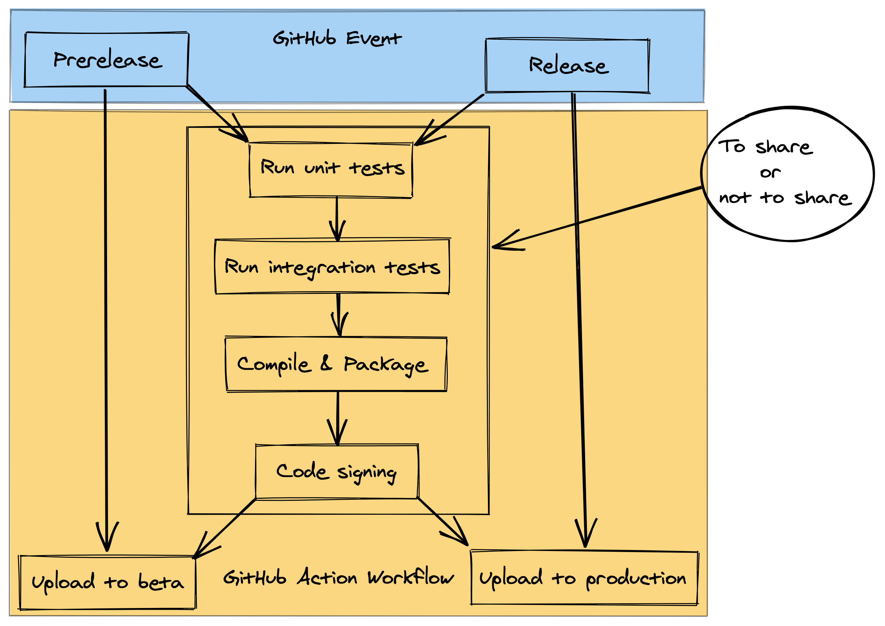

# GitHub Actions

## Triggering

## Conditions

Conditions refer to controling the behavior of workflows with the context variable which is more fine-grained than [triggering](#triggering).

An example is release vs prerelease:

## References

- [Workflow syntax](https://help.github.com/en/actions/reference/workflow-syntax-for-github-actions)
- [Condition evaluation](https://help.github.com/en/actions/reference/context-and-expression-syntax-for-github-actions)
  - [Examples](./conditions)

<Disqus/>
