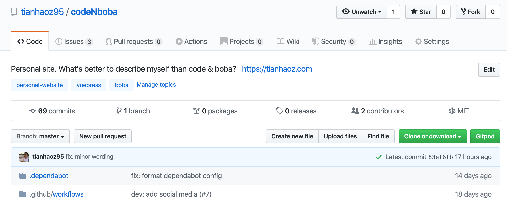
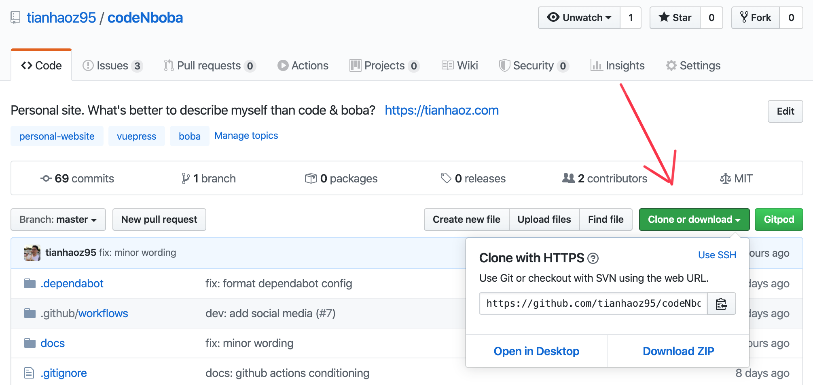
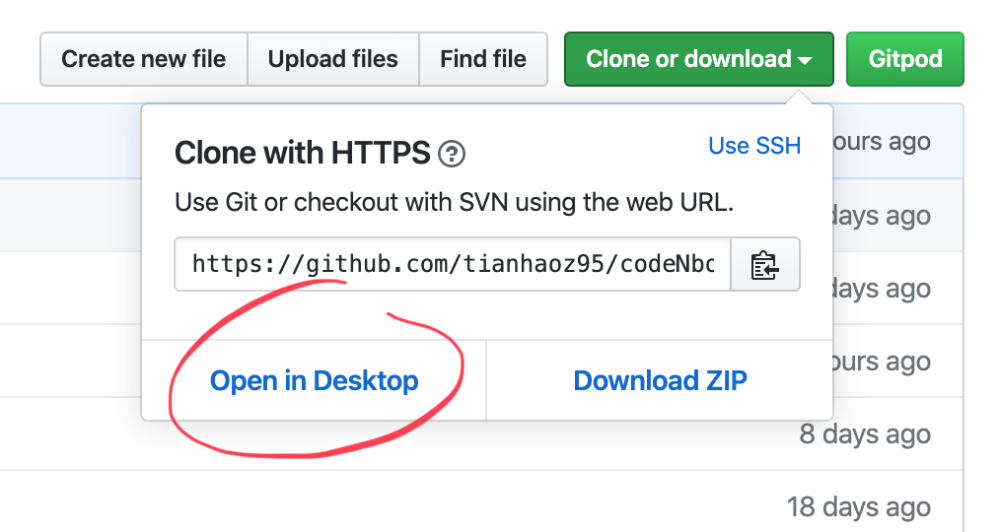
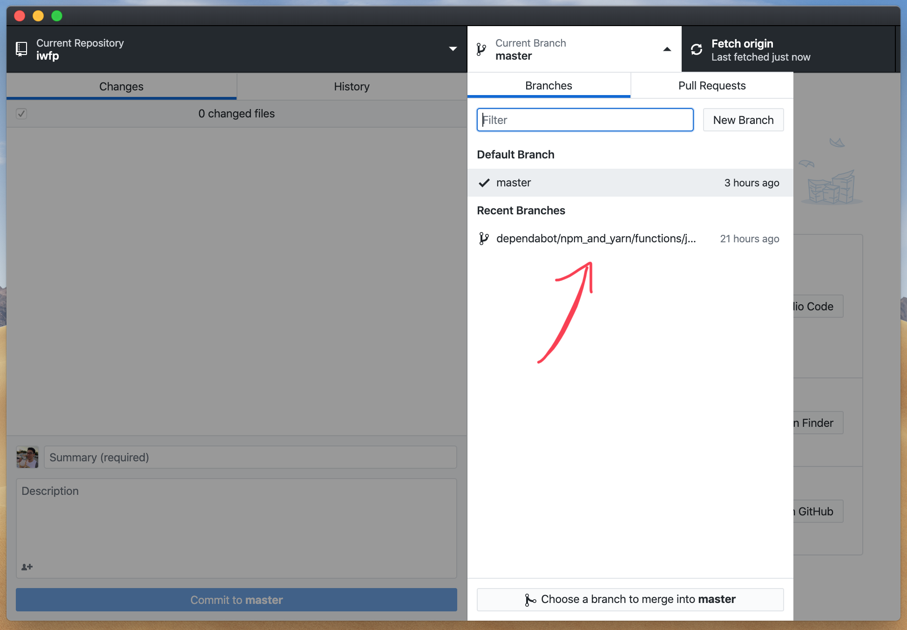

# GitHub Cheat Sheet

## Clone

Clone means downloading a repository hosted on GitHub to your local machine.

To clone a repository, first open the repository on GitHub:



Then click on "Clone or download" and copy the url that showed up:



### Terminal

After copying the url, use the following command in terminal where `https://github.com/tianhaoz95/codeNboba.git` should be the url you just copied:

```bash
git clone https://github.com/tianhaoz95/codeNboba.git
```

### Desktop app

Cloning a repository with the GitHub Desktop app is much eaiser with just a simple click on "Open in Desktop":



## Branch

### Create a branch

### Delete a branch

### Check out a branch

#### Desktop app



#### Terminal

```bash
git checkout [awesome_branch_name]
```

::: tip Note
If the branch is newly created with the web or desktop app, do `git pull` or `git fetch` first.
:::
