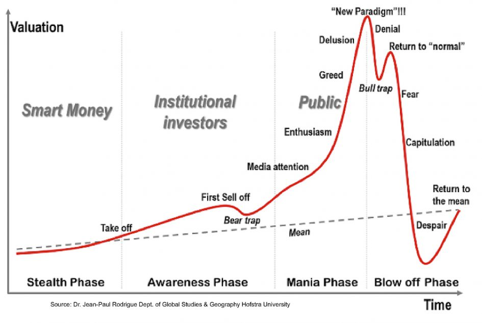

# Tips

## Rules of thumbs

### CAN SLIM

> The rule is quoted from <investors.com> for easier access, the original post is linked at the bottom of this section.

**Current Quarterly Earnings**

Earnings Growth is an important factor to look at when buying stocks. Look for stocks with increases in current quarterly earnings of at least 25%.

**Annual Earnings Growth**

In addition to quarterly earnings you want to make sure companies are showing strong long term growth. Look for stocks that have grown their earnings at least 25% or more for the past 3 years.

**New Product, Service, Management or Price High**

Studies of the great stock market winners of the past all had something NEW. Always look for companies with new, game-changing products and services.

**Supply and Demand**

S is for Supply and Demand. As more investors demand a limited supply of shares, a stock's price goes up. Look for heavy-volume accumulation by institutional investors, particularly at buy points.

**Leader or Laggard**

We are always looking to buy leading stocks in leading industry groups. Look for the best of the best - the leaders in strong industries that are showing superior earnings growth and sales.

**Institutional Sponsorship**

Professional investors, like mutual funds and pension funds, account for about 75% of all market activity. Using IBD and Investors.com, you'll learn how to follow the big money.

**Market Direction**

Our study shows 3 out of 4 stocks follow the market's trend, so you always want to trade in sync with the market. IBD makes it easy to keep up with the market's general trend.

This is copied over from the original post for easier access. For more details, check:

- The [original post](https://www.investors.com/ibd-university/can-slim/) that defines CAN SLIM
- [The C In CAN SLIM Stands For Current Earnings Growth](https://www.investors.com/how-to-invest/investors-corner/in-can-slim-quarterly-earnings-are-most-important/)

## Recession

Famous recessions in the history looks like the following, but history **doesn't** always repeat itself and most of the statistics are false ;)

